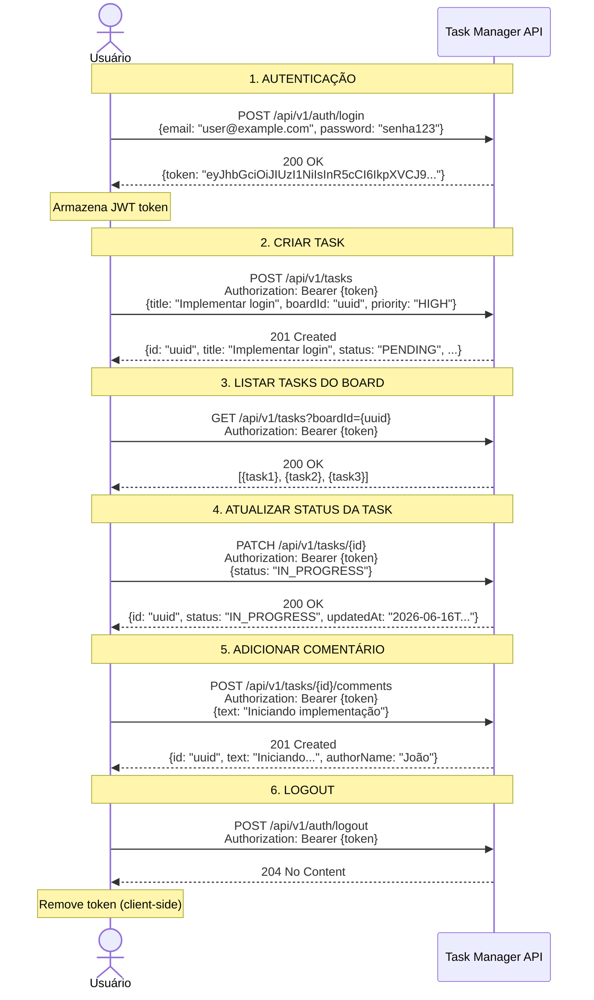
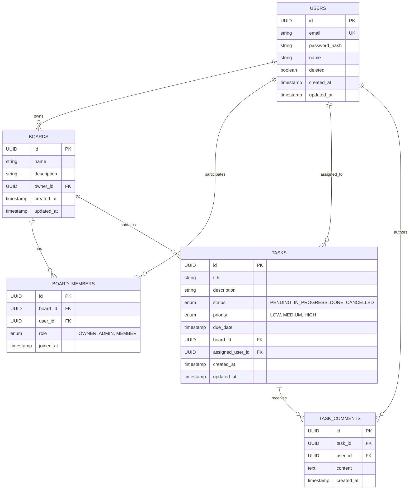

# Task Manager API

> **Trabalho T2 — Engenharia de Software: Arquitetura e Padrões**  
> UNISINOS · Prof. Guilherme Silva de Lacerda

---

## Índice

1. [Visão Geral](#-visão-geral)
2. [Stack Tecnológica](#-stack-tecnológica)
3. [Arquitetura](#-arquitetura)
4. [Modelagem de Dados](#-modelagem-de-dados)
5. [API Endpoints](#-api-endpoints)
6. [Como Rodar](#-como-rodar)
7. [Autenticação](#-autenticação)
8. [Exemplos de Uso](#-exemplos-de-uso)
9. [Estrutura do Projeto](#-estrutura-do-projeto)
10. [Decisões Técnicas](#-decisões-técnicas)

---

## Visão Geral

API RESTful para um **sistema de gestão de tarefas colaborativas**, permitindo:

- Criar e gerenciar usuários com autenticação usando JWTs
- Adicionar membros a boards (com controle de permissões)
- Criar e gerenciar tarefas com status, prioridade e atribuição
- Comentar em tarefas
- Filtros avançados de tarefas (status, prioridade, busca por texto)

---

## Stack

| Componente | Tecnologia
|------------|-----------
| **Linguagem** | Java 21 |
| **Framework** | Spring Boot |
| **Banco de Dados** | PostgreSQL 16 Alpine |
| **Migrations** | Liquibase |
| **Documentação API** | SpringDoc OpenAPI 3 |
| **Build** | Maven 3.9 |
| **Infra** | Docker Compose |
| **Utilities** | Lombok | 1.18.46 |
| **Testes** | JUnit 5 + Mockito |

---

## Arquitetura

### Arquitetura em Camadas

```mermaid
flowchart TD
    Client["Cliente HTTP"]

    subgraph Security["Security Layer"]
        JWT["JwtAuthenticationFilter"]
        SC["SecurityConfig"]
    end

    subgraph Controllers["Controllers"]
        AC["AuthController"]
        UC["UserController"]
        BC["BoardController"]
        TC["TaskController"]
        TCC["TaskCommentController"]
    end

    subgraph Services["Services"]
        US["UserService"]
        BS["BoardService"]
        TS["TaskService"]
        TCS["TaskCommentService"]
    end

    subgraph Repositories["Repositories"]
        UR["UserRepository"]
        BR["BoardRepository"]
        BMR["BoardMemberRepository"]
        TR["TaskRepository"]
        TCR["TaskCommentRepository"]
    end

    subgraph Entities["Entities"]
        E["User · Board · BoardMember<br/>Task · TaskComment"]
    end

    DB[("PostgreSQL 16")]

    Client --> Security
    Security --> Controllers
    Controllers --> Services
    Services --> Repositories
    Repositories --> Entities
    Entities --> DB

    classDef clientStyle fill:#E3F2FD,stroke:#1976D2,stroke-width:2px,color:#0D47A1
    classDef securityStyle fill:#FFF3E0,stroke:#F57C00,stroke-width:2px,color:#E65100
    classDef controllerStyle fill:#F3E5F5,stroke:#7B1FA2,stroke-width:2px,color:#4A148C
    classDef serviceStyle fill:#E8F5E9,stroke:#388E3C,stroke-width:2px,color:#1B5E20
    classDef repoStyle fill:#E1F5FE,stroke:#0288D1,stroke-width:2px,color:#01579B
    classDef entityStyle fill:#FFF9C4,stroke:#F9A825,stroke-width:2px,color:#F57F17
    classDef dbStyle fill:#37474F,stroke:#607D8B,stroke-width:3px,color:#ECEFF1

    class Client clientStyle
    class JWT,SC securityStyle
    class AC,UC,BC,TC,TCC controllerStyle
    class US,BS,TS,TCS serviceStyle
    class UR,BR,BMR,TR,TCR repoStyle
    class E entityStyle
    class DB dbStyle
```



### Fluxo



---

## Modelagem de Dados

### Diagrama ER



## Como Rodar

### Pré-requisitos

- **Java 21** ou superior
- **Maven 3.9+**
- **Docker**

### 1. Clone o repositório

```bash
git clone <repository-url>
cd taskmanager
```

### 2. Suba o banco de dados PostgreSQL

```bash
docker compose up -d
```

Verifique se está rodando:
```bash
docker compose ps
```

### 3. Execute a aplicação

```bash
./mvnw spring-boot:run
```

### 4. Acesse

| URL | Descrição |
|-----|-----------|
| `http://localhost:8080` | API Base |
| `http://localhost:8080/swagger-ui.html` | Swagger UI |
| `http://localhost:8080/v3/api-docs` | OpenAPI JSON spec |

### 5. Verifique o banco de dados

```bash
docker exec -it taskmanager-db psql -U taskuser -d taskmanager

# Dentro do psql:
\dt                          # Lista todas as tabelas
\d users                     # Describe da tabela users
SELECT * FROM databasechangelog;  # Vê migrations aplicadas
```

### 6. Teste a API com Bruno

Use a collection do Bruno em `docs/collection/` para testar todos os endpoints.

- a. Instale o [Bruno](https://www.usebruno.com/) (cliente API open-source)
- b. Abra o Bruno e clique em "Open Collection"
- c. Navegue até `docs/collection/` no projeto
- d. A collection será carregada com todos os endpoints configurados

### Parar tudo

```bash
docker compose down          # Para containers
docker compose down -v       # Para e remove volumes (apaga dados)
```

---
